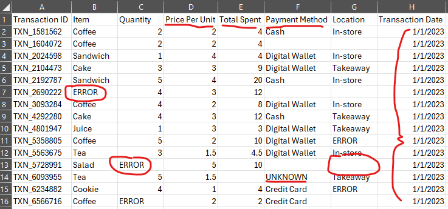

# Cafe Sales Cleanup and Analysis
- **WHAT?** My goal is to take a messy Cafe Sales dataset and prepare it for EDA and visualization methods to answer key questions that can help drive marketing and business decisions.
- **HOW?** Using **R's** powerful, quick data cleaning packages and syntax.
- **WHY?** Not only do I want to showcase my skills in data cleaning and wrangling, but I also want viewers, who are looking to learn the ins and outs of R for data cleaning, to understand how the syntax is used.

## BEFORE:

## AFTER:
*insert dashboard*

## Scenario:
#### Data Source: [cafe-sales-dirty-data-for-cleaning-training](https://www.kaggle.com/datasets/ahmedmohamed2003/cafe-sales-dirty-data-for-cleaning-training) 
This dataset contains transaction data from a cafe that has several issues:
- missing values in multiple columns (e.g., "Item," "Quantity," "Price Per Unit").
- Some incorrect or placeholder values (e.g., "ERROR" in "Total Spent," "UNKNOWN" in "Location" and "Payment Method").
- "Quantity," "Price Per Unit," and "Total Spent" are stored as text and might need conversion to numeric.
- Dates are in inconsistent formats.

#### Menu Items
The dataset includes the following menu items with their respective price ranges:
| Item      | Price ($) |
|-----------|----------|
| Coffee    | 2.00     |
| Tea       | 1.50     |
| Sandwich  | 4.00     |
| Salad     | 5.00     |
| Cake      | 3.00     |
| Cookie    | 1.00     |
| Smoothie  | 4.00     |
| Juice     | 3.00     |

### Setup
1.) Download necessary packages on R

## Post-cleaning Goals:
  ### Analysis Questions:
  - **Best-selling items**: What are the top-selling food and drink items?
  - **Highest revenue generators**: Which items bring in the most money?
  - **Popular methods**: Are customers buying more in-store, takeaway, or elsewhere?
  - **Payment trends**: What is the most common payment method? Should we push digital wallets more?
  - **Sales over time**: Are there seasonal trends? Do weekends perform better than weekdays?
 
  ### Visualization
  - Create dashboards showing key trends and insights
  - Use interactive visuals for item popularity, payment methods, and revenue trends
    (insert dashboard here) !!!
